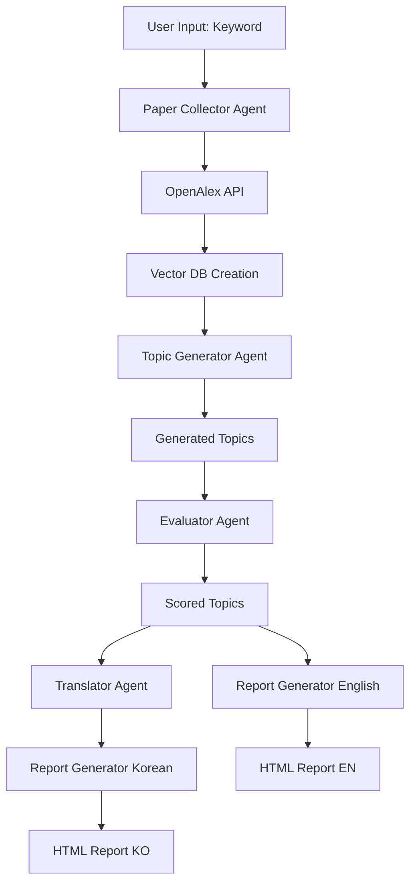

# Research Topic Brainstorming Tool

[](https://www.python.org/)
[](https://ollama.ai/)
[](https://www.docker.com/)
[](https://streamlit.io/)
[](https://www.langchain.com/)
[](https://www.trychroma.com/)

> **AI-powered research topic generation and evaluation system** that leverages multiple specialized agents to discover innovative research directions based on academic papers from OpenAlex API.

---

## 📋 Table of Contents

- [Overview](#overview)
- [Features](#features)
- [Architecture](#architecture)
- [Prerequisites](#prerequisites)
- [Installation](#installation)
- [Configuration](#configuration)
- [Usage](#usage)
- [Project Structure](#project-structure)
- [How It Works](#how-it-works)
- [Output](#output)
- [Customization](#customization)
- [Troubleshooting](#troubleshooting)
- [Contributing](#contributing)
- [License](#license)

---

## 🎯 Overview

This tool uses a **multi-agent AI system** to help researchers brainstorm novel research topics. By analyzing academic papers from the OpenAlex database, it generates, evaluates, and prioritizes research topics across multiple dimensions (originality, feasibility, impact).

The system employs **local LLMs via Ollama**, making it cost-free and privacy-preserving while providing powerful research assistance. It is optimized for local hardware (e.g., Apple Silicon) by actively managing memory usage.

---

## ✨ Features

### 🔍 **Automated Paper Collection**
- Fetches academic papers from [OpenAlex API](https://docs.openalex.org/) based on keywords
- Reconstructs abstracts from inverted index format
- Saves collected papers to CSV for later analysis

### 🧠 **Multi-Agent Architecture**
1. **Collector Agent**: Retrieves and indexes research papers into a vector database
2. **Generator Agent**: Creates innovative research topics based on paper context
3. **Evaluator Agent**: Scores topics on originality, feasibility, and impact
4. **Translator Agent**: Translates reports into target languages (e.g., Korean)

### ⚡ **Optimized for Local Execution**
- **Memory Management**: Automatically unloads LLMs from memory when not in use to prevent OOM errors on consumer hardware (e.g., MacBook Pro).
- **Batch Processing**: Processes vector embeddings in small batches.

### 📊 **Vector Database Integration**
- Uses **ChromaDB** for semantic search over papers
- Embeddings via Ollama's `nomic-embed-text` model
- Efficient batch processing to avoid API overload

### 🎨 **Beautiful HTML Reports**
- Auto-generated professional HTML reports (English + Korean)
- Color-coded scoring system
- Organized sections: Background, Necessity, Table of Contents, Expected Effects
- Related papers linked to each topic

### 🌐 **Multi-Language Support**
- Automatic translation of research topics and evaluations
- Professional academic tone preservation

### 🖥️ **Interactive Web Interface**
- **Streamlit App**: User-friendly GUI for research and chatting
- **RAG Chat**: Interactive chat with collected papers
- **Real-time Progress**: Visual feedback during research tasks

### 🐳 **Docker Support**
- **Containerized**: Easy deployment with Docker and Docker Compose
- **Isolated Environment**: No need to manage local Python dependencies

---

## 🏗️ Architecture



### Agent Responsibilities

| Agent | Model | Temperature | Function |
|-------|-------|-------------|----------|
| **Collector** | `nomic-embed-text` | N/A | Fetches papers, creates embeddings |
| **Generator** | `deepseek-r1:14b` | 0.3 | Generates creative research topics |
| **Evaluator** | `gpt-oss:20b` | 0.3 | Scores topics objectively |
| **Translator** | `gpt-oss:20b` | 0.3 | Translates content accurately |

---

## 📦 Prerequisites

### Required Software

1. **Python 3.8+**
   ```bash
   python3 --version
   ```

2. **Ollama** ([Installation Guide](https://ollama.ai/))
   ```bash
   # Install Ollama (macOS/Linux)
   curl -fsSL https://ollama.ai/install.sh | sh
   
   # Verify installation
   ollama --version
   ```

3. **Required Ollama Models**
   ```bash
   # Pull embedding model
   ollama pull nomic-embed-text:latest
   
   # Pull generator model
   ollama pull deepseek-r1:14b
   
   # Pull evaluator/translator model
   ollama pull gpt-oss:20b
   ```

---

## 🚀 Installation & Usage

### Option A: Docker (Recommended)

The easiest way to run the application is using Docker.

#### 1. Prerequisites
- [Docker Desktop](https://www.docker.com/products/docker-desktop/) installed
- [Ollama](https://ollama.ai/) running on your host machine (`ollama serve`)

#### 2. Run with Docker Compose
```bash
docker-compose up --build
```

#### 3. Access the App
Open your browser and navigate to: [http://localhost:8501](http://localhost:8501)

---

### Option B: Local Python Setup

#### 1. Clone the Repository
```bash
git clone https://github.com/yourusername/MultiAgents_with_Ollama.git
cd MultiAgents_with_Ollama
```

#### 2. Install Dependencies
```bash
pip install -r requirements.txt
```

#### 3. Run the Streamlit App
```bash
streamlit run streamlit_app.py
```


#### 4. Run CLI (Legacy Mode)
You can still use the command-line interface:
```bash
python main.py "machine learning" --limit 50 --topics 3
```

---

## 📁 Project Structure

```
MultiAgents_with_Ollama/
├── agents/                          # Multi-agent system modules
│   ├── collector.py                 # Paper collection & vector DB creation
│   ├── generator.py                 # Research topic generation
│   ├── evaluator.py                 # Topic evaluation & scoring
│   └── translator.py                # Multi-language translation
├── utils/                           # Utility functions
│   └── report_generator.py          # HTML report generation
├── results/                         # Output files (auto-created)
│   ├── csv/                         # Downloaded papers in CSV format
│   │   └── papers_*.csv             # Timestamped paper collections
│   ├── report_*.html                # English HTML reports
│   └── report_*_ko.html             # Korean HTML reports
├── chroma_db/                       # Vector database storage (auto-created)
├── config.py                        # Configuration file
├── main.py                          # CLI entry point
├── streamlit_app.py                 # Web application entry point
├── Dockerfile                       # Docker image definition
├── docker-compose.yml               # Docker services orchestration
├── requirements.txt                 # Python dependencies
└── README.md                        # This file
```

### Key Files

#### `main.py`
Entry point that orchestrates the entire pipeline. It includes **automatic model unloading** to ensure smooth operation on devices with limited VRAM (e.g., 24GB Unified Memory).

#### `agents/collector.py`
- `PaperCollector` class
- Fetches papers from OpenAlex API
- Reconstructs abstracts from inverted index
- Creates ChromaDB vector store with embeddings

#### `agents/generator.py`
- `TopicGenerator` class
- Uses RAG (Retrieval-Augmented Generation) approach
- Generates structured research topics with detailed sections

#### `agents/evaluator.py`
- `TopicEvaluator` class
- Scores topics on **Originality**, **Feasibility**, and **Impact**
- Provides reasoning for scores

#### `agents/translator.py`
- `TopicTranslator` class
- Translates all topic content while preserving academic tone

#### `utils/report_generator.py`
- `generate_html_report()` function
- Creates beautiful, responsive HTML reports

#### `config.py`
Central configuration file for all system parameters.

---

## 🔄 How It Works

1. **Paper Collection**: Queries OpenAlex API for papers related to the keyword.
2. **Vector DB Creation**: Embeds paper abstracts using `nomic-embed-text` and stores them in ChromaDB. *The embedding model is unloaded immediately after this step.*
3. **Topic Generation**: The Generator Agent (`deepseek-r1:14b`) retrieves relevant papers and brainstorms innovative research topics. *The generator model is unloaded after this step.*
4. **Topic Evaluation**: The Evaluator Agent (`gpt-oss:20b`) scores each topic based on defined criteria.
5. **Report Generation**: Produces an English HTML report.
6. **Translation**: The Translator Agent (using `gpt-oss:20b`) creates a Korean version of the report.
7. **Cleanup**: All models are ensured to be unloaded from memory.

---

## 📊 Output

### Generated Files

All output files are organized in the `results/` directory:

1. **CSV File**: `results/csv/papers_<keyword>_<timestamp>.csv`
   - All collected papers with metadata
2. **English Report**: `results/report_<keyword>.html`
   - Ranked research topics with full details
3. **Korean Report**: `results/report_<keyword>_ko.html`
   - Same content, translated to Korean
4. **Vector Database**: `chroma_db/`
   - Persistent ChromaDB storage

---

## 🎨 Customization

### Change AI Models

Edit `config.py`:

```python
MODEL_GENERATOR = "llama3:70b"  # Use a different model
MODEL_EVALUATOR = "mistral:7b"
```

### Adjust Creativity vs Consistency

```python
# More creative topic generation
GENERATOR_TEMPERATURE = 0.9

# More consistent evaluation
EVALUATOR_TEMPERATURE = 0.1
```

---

## 🛠️ Troubleshooting

### Issue: "Connection refused to localhost:11434"
**Solution**: 
- **Local**: Make sure Ollama is running: `ollama serve`
- **Docker**: Ensure `OLLAMA_BASE_URL` is set to `http://host.docker.internal:11434` (default in docker-compose).

### Issue: "Model not found"
**Solution**: Pull the required models: `ollama pull <model_name>`

### Issue: Out of memory
**Solution**:
- The system automatically unloads models, but you can further optimize by reducing `VECTOR_DB_BATCH_SIZE` in `config.py`.
- Reduce the number of papers (`--limit 20`).

### Issue: OpenAlex API rate limiting
**Solution**: Add your email to `config.py` (`USER_AGENT_EMAIL`) to access the "polite pool".

---

## 🤝 Contributing

Contributions are welcome! Please fork the repository and submit a Pull Request.

---

## 📄 License

This project is licensed under the MIT License.

---

## 🙏 Acknowledgments

- **OpenAlex**: For providing free, open access to academic metadata
- **Ollama**: For making local LLMs accessible and easy to use
- **LangChain**: For the excellent LLM orchestration framework
- **ChromaDB**: For the fast and simple vector database
